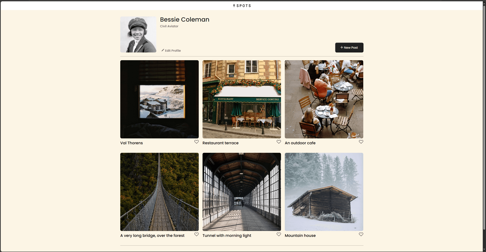
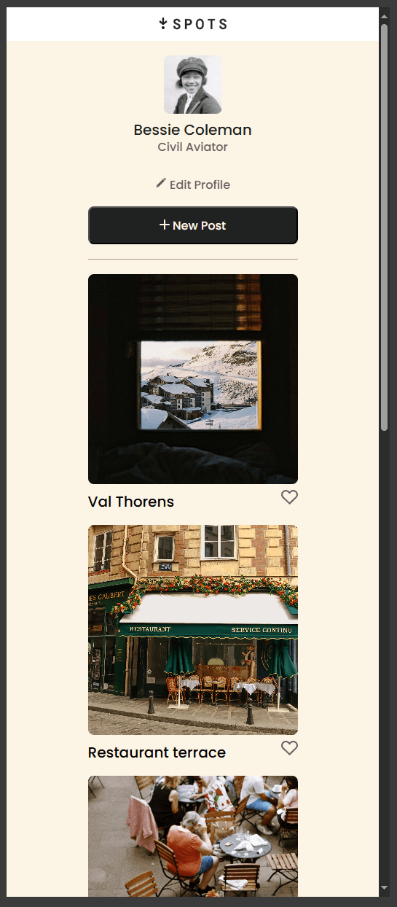

# Project 3: Spots

## Description

An image-sharing site that lets users upload and browse photo posts in a clean, resposive layout. Designed with simplicity in mind, Sports Delivers a seamless experience across all devices.

## Features

- Upload and view images
- Fully responsive mobile and tablet friendly interface
- Simple, user-friendly image feed

## Tech Stack

- HTML – for clean, semantic structure
- CSS – for layout and design
- Responsive Design Techniques – adapted layout for mobile and tablet screens using media queries

## Deployment

This webpage is deployed to GitHub Pages

- [Deployment Link:](https://ryaninzacruz.github.io/se_project_spots/)

## Screenshots

### Home Page

### Mobile-View

### Screen Recording

